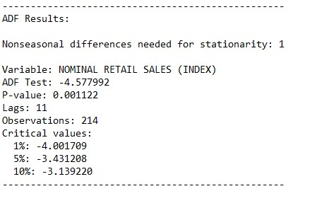

# **DESCRIPTION**
For nominal sales, the gross resale revenue, total and per Federation Unit, is considered, defined within the company as the monthly gross revenue from the resale of goods, not deducting applicable taxes or canceled sales, rebates and taxes unconditional, also not considering in its calculation the relative prices of the IPCA or any type of deflation. For extended retail trade, it is considered commercial units that resell new and used goods, without transformation, both to companies and to the general public, whether for consumption or personal or domestic use. Traditional commerce is included in stores open to the public as well as retailing through non-traditional means, such as catalogue, door-to-door, television, internet and others. Base is the value, at a given moment (effective or resulting from the average taken within a time interval) that serves as a term of comparison, when one wants to calculate a succession of index numbers.

Data source: Instituto Brasileiro de Geografia e Estatística, Pesquisa Mensal de Comércio (IBGE/PMC).

# **RESULTS**
Results obtained through the model estimation process.

## Variable analysis at level:
    

    

    

    

## Study of data stationarity:
    

    

## SEASONAL ADJUSTMENT:
    

    

## Model results:
    

## Residual analysis:
    

    

    

# FORECAST:
    
